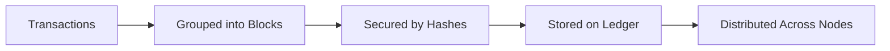

If you're new to blockchain, you’ve probably heard terms like **block**, **hash**, **node**, and **ledger**. These are the core building blocks of blockchain technology, but most explanations online make them sound complicated.

This guide explains them **clearly and simply** using real-world examples.

---

## Quick Recap

In previous articles:
- We explained [what blockchain is]().
- We explored [how a blockchain transaction works]().

✅ Now we go deeper into the **components that make blockchain possible**.

---

## Overview

| Term | Short Explanation |
|------|--------------------|
| Ledger | A record of transactions |
| Block | A container of transaction data |
| Hash | A digital fingerprint |
| Node | A computer in the blockchain network |

---

## 1. What Is a Ledger?

A **ledger** is simply a **record of transactions**. It keeps track of who sent what to whom. Every blockchain uses a ledger to store transaction history.

### Real-World Example
Imagine you keep a notebook of all the money you lend to and borrow from friends. That notebook acts as a **ledger**.

### Traditional Ledger vs Blockchain Ledger

| Traditional Ledger | Blockchain Ledger |
|--------------------|-------------------|
| Stored by one company or bank | Shared across many computers |
| Private | Public or semi-public |
| Can be changed or edited | Almost impossible to tamper with |
| Single point of failure | Decentralized |

The ledger is the **foundation** of blockchain.

---

## 2. What Is a Block?

A **block** is a **collection of transactions** grouped together. Think of it as **one page in a digital record book**. Every few seconds or minutes (depending on the blockchain), a new block is created.

### What’s Inside a Block?

| Part | Description |
|------|-------------|
| Block Header | Summary information about the block |
| Timestamp | When the block was created |
| Transaction Data | The list of transactions |
| Previous Block Hash | Connects this block to the one before it |
| Nonce (in Proof of Work) | A number used during mining |

## 3. What Is a Hash?

A **hash** is a **unique digital fingerprint** that represents data. In blockchain, hashes are used to secure data and connect blocks together.

### Example
If you hash the word `Blockchain`, you might get:

62574e4c7a48dc5b32e5d4cb3b8fb1fae70cbeecff8f93f698ef2647a4a6c400

If even **one letter changes**, the hash becomes completely different. This makes hashes useful for detecting tampering.

### Why Hashes Matter
- They protect data
- They link blocks together securely
- They make blockchain tamper-resistant

---

## 4. What Is a Node?

A **node** is a **computer that runs blockchain software** and stores a copy of the blockchain. Nodes are what make blockchain **decentralized**.

### Types of Nodes

| Type | Purpose |
|------|---------|
| Full Node | Stores full blockchain data |
| Light Node | Stores only essential data |
| Miner/Validator Node | Creates new blocks |

Nodes also help verify transactions and keep the blockchain running.

---

## How These Fit Together

Here’s how blocks, hashes, nodes, and ledgers work together inside blockchain:

- Transactions go into blocks
- Blocks are secured using hashes
- The history of blocks is stored in the ledger
- The ledger is shared across nodes

## Summary
Term	Meaning	Role in Blockchain
Ledger	Record of transactions	Stores history
Block	Data container	Stores transactions
Hash	Digital fingerprint	Prevents tampering
Node	Network computer	Runs the blockchain

## Final Thoughts
These four concepts are the foundation of blockchain. Once you understand blocks, hashes, nodes, and ledgers, everything else in Web3 becomes easier to learn.

